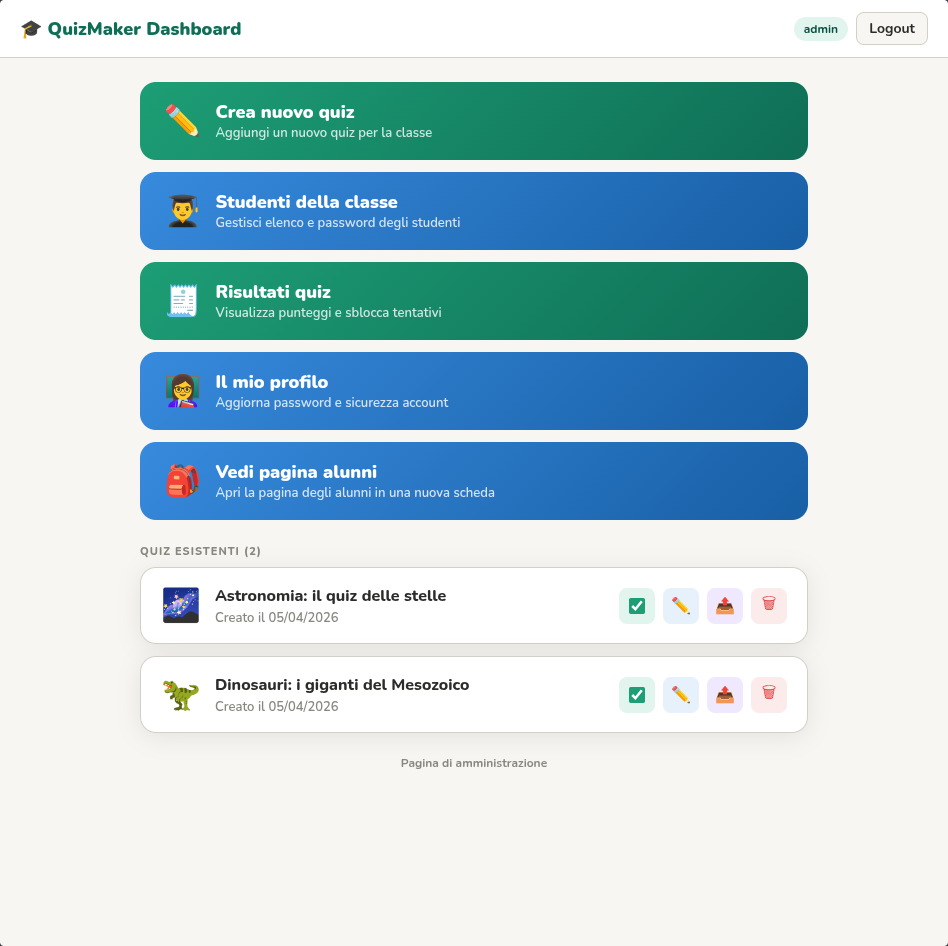

# Alice's Simple Quiz Maker 🦕

Applicazione Spring Boot per creare, pubblicare e somministrare quiz scolastici divertenti, con interfaccia web e API REST.



[](https://www.gnu.org/licenses/gpl-3.0)


[](https://sonarcloud.io/summary/new_code?id=saidone75_quizmaker_springboot)
[](https://sonarcloud.io/summary/new_code?id=saidone75_quizmaker_springboot)
[](https://sonarcloud.io/summary/new_code?id=saidone75_quizmaker_springboot)

## Caratteristiche principali

- Software libero e open source con licenza [GPLv3](https://www.gnu.org/licenses/gpl-3.0)
- Accesso **insegnante** con registrazione self-service e dashboard dedicata (`/teacher/...`).
- Gestione **multi-insegnante** con ruoli amministratore/non-amministratore, abilitazione account, reset password e cancellazione completa account (solo amministratore).
- Generazione quiz con **OpenAI** (opzionale) e supporto allegati (`.pdf`, `.docx`, testo).
- Condivisione quiz verso più insegnanti.
- Gestione risultati con analytics e sblocco tentativi singolo studente o in blocco.
- Backup schedulato database SQLite in produzione con retention configurabile.
- Semplice dispiegamento in cloud o on premise.

## Stack tecnologico

- Java **21**
- Spring Boot **4.0.x**
- Spring Security
- Thymeleaf
- JPA/Hibernate + Liquibase
- H2 (dev/docker) e SQLite (prod)
- Jetty (embedded server)

## Avvio rapido in sviluppo (profilo `dev`)

```bash
mvn spring-boot:run
```

Oppure con profilo esplicito:

```bash
mvn spring-boot:run -Dspring-boot.run.profiles=dev
```

Link utili in locale:

- App: http://localhost:8080
- Login insegnante: http://localhost:8080/teacher/login
- Registrazione insegnante: http://localhost:8080/teacher/register
- Console H2 (dev): http://localhost:8080/h2-console
- JDBC URL H2: `jdbc:h2:mem:quizmakerdb`
- User H2: `sa`
- Password H2: *(vuota)*

## Credenziali iniziali

L'app crea un utente amministratore di default via configurazione:

| Username | Password   |
|----------|------------|
| `admin`  | `changeme` |

⚠️ Cambia subito password in ambienti non di sviluppo.

Variabili d'ambiente:

```bash
export ADMIN_USERNAME=admin
export ADMIN_PASSWORD='$2a$12$...'
```

> `ADMIN_PASSWORD` può essere una password in chiaro o un hash bcrypt (anche con prefisso `{bcrypt}`).

## Profili runtime

### `dev`

- DB H2 in-memory
- H2 console attiva
- Turnstile attivo per default con chiavi di test

### `prod`

- DB SQLite (`jdbc:sqlite:./data/quizmaker.db` di default)
- Cookie sessione con `Secure=true` e `SameSite=Strict`
- Backup DB abilitato di default

Esempio avvio produzione:

```bash
export PROD_SQLITE_DB_URL=jdbc:sqlite:/opt/quizmaker/data/quizmaker.db
export ADMIN_USERNAME=admin
export ADMIN_PASSWORD='$2a$12$...'

java -jar target/quizmaker-*.jar --spring.profiles.active=prod
```

### `docker`

- DB H2 in-memory
- Profilo dedicato per container (`SPRING_PROFILES_ACTIVE=docker`)

```bash
docker compose -f docker/docker-compose.yml up --build
```

## Variabili d'ambiente principali

| Variabile                           | Default                           | Descrizione                                  |
|-------------------------------------|-----------------------------------|----------------------------------------------|
| `ADMIN_USERNAME`                    | `admin`                           | Username amministratore iniziale             |
| `ADMIN_PASSWORD`                    | `changeme`                        | Password amministratore iniziale             |
| `PROD_SQLITE_DB_URL`                | `jdbc:sqlite:./data/quizmaker.db` | Path DB SQLite in produzione                 |
| `OPENAI_API_KEY`                    | vuota                             | API key OpenAI                               |
| `OPENAI_MODEL`                      | `gpt-5.4-mini`                    | Modello per generazione quiz                 |
| `AI_GENERATION_MAX_QUESTIONS`       | `20`                              | Numero massimo domande generate              |
| `AI_GENERATION_MAX_ATTACHMENT_CHARS`| `60000`                           | Max caratteri estratti da allegato           |
| `AI_GENERATION_MAX_ATTEMPTS`        | `2`                               | Tentativi massimi di generazione/validazione |
| `TURNSTILE_ENABLED`                 | `false` (`true` in dev)           | Abilita verifica CAPTCHA Turnstile           |
| `TURNSTILE_SITE_KEY`                | vuota (o test key in dev)         | Site key Turnstile                           |
| `TURNSTILE_SECRET_KEY`              | vuota (o test key in dev)         | Secret key Turnstile                         |
| `TURNSTILE_VERIFY_URL`              | endpoint Cloudflare               | URL verifica Turnstile                       |
| `DB_BACKUP_ENABLED`                 | `false` (`true` in prod)          | Abilita job backup SQLite                    |
| `DB_BACKUP_CRON`                    | `0 0 2 * * *`                     | Pianificazione backup                        |
| `DB_BACKUP_DIRECTORY`               | `./backups`                       | Directory output backup                      |
| `DB_BACKUP_RETENTION_COUNT`         | `30`                              | Numero backup mantenuti                      |
| `SESSION_COOKIE_SECURE`             | `true` (prod)                     | Cookie di sessione solo HTTPS                |

## Backup schedulato database (SQLite)

```bash
export DB_BACKUP_ENABLED=true
export DB_BACKUP_CRON="0 0 2 * * *"
export DB_BACKUP_DIRECTORY="./backups"
export DB_BACKUP_RETENTION_COUNT=30
```

## Funzionalità web

| URL                        | Accesso                      | Descrizione                            |
|----------------------------|------------------------------|----------------------------------------|
| `/`                        | Pubblico / sessione studente | Login studente + pagina quiz           |
| `/teacher/login`           | Pubblico                     | Login insegnante                       |
| `/teacher/register`        | Pubblico                     | Registrazione insegnante               |
| `/teacher`                 | Insegnante                   | Dashboard quiz                         |
| `/teacher/students`        | Insegnante                   | Gestione studenti                      |
| `/teacher/results`         | Insegnante                   | Risultati + analytics + sblocco quiz   |
| `/teacher/logs`            | Amministratore               | Visualizzazione log applicativi        |
| `/teacher/profile`         | Insegnante                   | Cambio password personale              |
| `/teacher/profile/theme`   | Insegnante                   | Salvataggio preferenza tema (POST)     |
| `/teacher/quiz/new`        | Insegnante                   | Editor nuovo quiz                      |
| `/teacher/quiz/{id}/edit`  | Insegnante                   | Editor modifica quiz                   |
| `/teacher/system`          | Amministratore               | Pannello sistema                       |
| `/teacher/system/teachers` | Amministratore               | Gestione insegnanti (ruoli, AI, stato) |
| `/teacher/about`           | Amministratore               | Info build/runtime                     |

## API principali

### Quiz (`/api/quizzes`)

- `GET /api/quizzes` elenco quiz pubblicati per studente autenticato.
- `GET /api/quizzes/{id}` dettaglio quiz pubblicato.
- `POST /api/quizzes/{id}/submit` invio risposte studente.
- `POST /api/quizzes` creazione quiz (insegnante).
- `PUT /api/quizzes/{id}` modifica quiz (insegnante).
- `DELETE /api/quizzes/{id}` eliminazione quiz (insegnante).
- `PUT /api/quizzes/{id}/publication` pubblicazione/depubblicazione.
- `PUT /api/quizzes/{id}/archived` archiviazione/riattivazione quiz.
- `POST /api/quizzes/{id}/share` condivisione quiz a più insegnanti.
- `POST /api/quizzes/{quizId}/unlock/{studentId}` sblocco tentativo singolo.
- `POST /api/quizzes/{quizId}/unlock-all` sblocco massivo tentativi.
- `POST /api/quizzes/generate` generazione quiz via AI (multipart, allegato opzionale).

### Studenti (`/api/students`)

- `GET /api/students` elenco studenti dell'insegnante corrente.
- `POST /api/students` creazione studente.
- `DELETE /api/students/{id}` eliminazione studente.
- `POST /api/students/{id}/regenerate-password` rigenera parola chiave singolo studente.
- `POST /api/students/regenerate-passwords` rigenera parole chiave in massa.

### Log (`/api/teacher/logs`)

- `GET /api/teacher/logs/tail?lines=200` ultime righe log applicazione (max 1000, solo amministratore).

### Profilo insegnante (`/teacher/profile`)

- `POST /teacher/profile/theme` aggiorna la preferenza tema insegnante (`system`, `light`, `dark`).

## Sicurezza

- CSRF con cookie token (eccetto H2 console).
- Login insegnante con blocco temporaneo dopo troppi tentativi falliti.
- Login studente protetto da rate-limit su IP e keyword.
- Registrazione insegnante rate-limited con integrazione Turnstile (se abilitato).
- Ruoli applicativi: `ROLE_STUDENT`, `ROLE_TEACHER`, `ROLE_ADMIN`.

## Database e migration

Le migration Liquibase sono in `src/main/resources/db/changelog/`.
Aggiungi ogni modifica schema in un nuovo file XML e includilo in `db.changelog-master.xml`.

## Test

```bash
mvn test
```

## Licenza

Copyright (c) 2026 Miss Alice & Saidone

Distributed under the GNU General Public License v3.0
