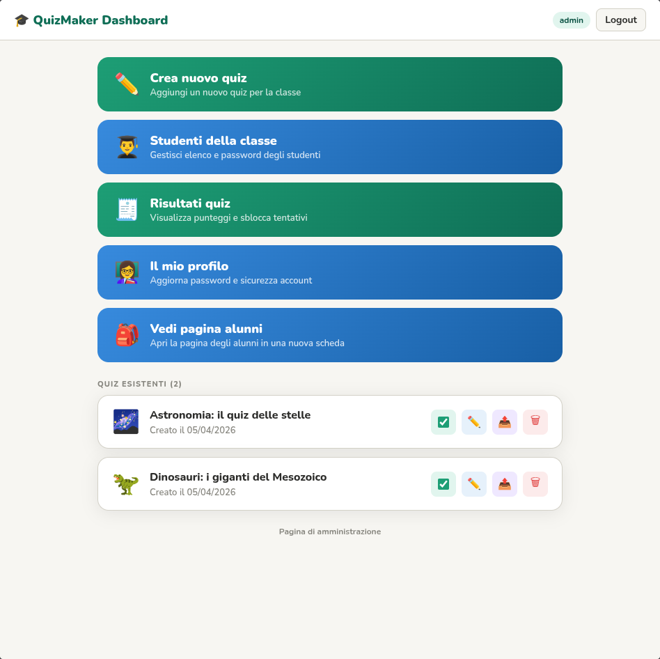

# 🐰 Alice's Simple Quiz Maker

Applicazione web per creare, pubblicare e somministrare quiz scolastici divertenti, con dashboard insegnante, area studente e API REST.



[](https://www.gnu.org/licenses/gpl-3.0)

[](https://sonarcloud.io/summary/new_code?id=saidone75_quizmaker_springboot)
[](https://sonarcloud.io/summary/new_code?id=saidone75_quizmaker_springboot)
[](https://sonarcloud.io/summary/new_code?id=saidone75_quizmaker_springboot)

## 📚 Indice

- [Perché usarlo](#-perché-usarlo)
- [Caratteristiche principali](#-caratteristiche-principali)
- [Stack tecnologico](#-stack-tecnologico)
- [Prerequisiti](#-prerequisiti)
- [Avvio rapido](#-avvio-rapido)
- [Build e test](#-build-e-test)
- [Credenziali iniziali](#-credenziali-iniziali)
- [Profili runtime](#-profili-runtime)
- [Variabili d'ambiente principali](#️-variabili-dambiente-principali)
- [Funzionalità web e API](#-funzionalità-web-e-api)
- [Sicurezza](#️-sicurezza)
- [Database e migration](#️-database-e-migration)
- [Contribuire](#-contribuire)

## 🎯 Perché usarlo

Alice's Simple Quiz Maker è pensato per chi desidera:

- creare quiz in pochi minuti;
- gestire studenti, risultati e tentativi in modo centralizzato;
- usare AI (opzionale) per generare domande a partire da un argomento o da allegati;
- usare immagini Wikimedia per quiz più visivi e coinvolgenti;
- condividere quiz tra insegnanti e riutilizzare materiali didattici.

## ✨ Caratteristiche principali

- Software libero e open source con licenza [GPLv3](https://www.gnu.org/licenses/gpl-3.0).
- Accesso **insegnante** con registrazione self-service e dashboard dedicata (`/teacher/...`).
- Gestione **multi-insegnante** con ruoli amministratore/non-amministratore, abilitazione account, reset password e cancellazione account (solo amministratore).
- Generazione quiz con **OpenAI** (opzionale) e supporto allegati (`.pdf`, `.docx`, testo).
- Ricerca immagini Wikimedia con modalità **advanced** e **simple**, configurabile globalmente e per insegnante.
- Condivisione quiz verso più insegnanti.
- Gestione risultati con analytics e sblocco tentativi singolo studente o massivo.
- Profilo insegnante con preferenze tema, ricerca immagini e gestione password.
- Architettura Spring con migrazioni schema DB versionate via Liquibase.
- Backup schedulato database SQLite in produzione con retention configurabile.

## 🧰 Stack tecnologico

- Java **21**
- Spring Boot **4.0.x**
- Spring Security
- Thymeleaf
- JPA/Hibernate + Liquibase
- H2 (dev/docker) e SQLite (prod)
- Jetty (embedded server)
- DJL (Deep Java Library) + Hugging Face Tokenizers
- Motore locale PyTorch CPU (nessun servizio esterno richiesto per ricerca semantica)

## ✅ Prerequisiti

Per avvio locale:

- JDK 21
- Maven 3.9+

Per avvio Docker:

- Docker
- Docker Compose

## 🚀 Avvio rapido

### 1) Locale (profilo `dev`)

```bash
mvn spring-boot:run
```

Con profilo esplicito:

```bash
mvn spring-boot:run -Dspring-boot.run.profiles=dev
```

Script alternativi:

- Avvio locale: `run.sh` (Linux/macOS) oppure `run.bat` (Windows)
- Avvio Docker: `quizmaker.sh` (Linux/macOS) oppure `quizmaker.bat` (Windows)

### 2) Docker (profilo `docker`)

```bash
docker compose -f docker/docker-compose.yml up --build
```

### Link utili in locale

- App: http://localhost:8080
- Login insegnante: http://localhost:8080/teacher/login
- Registrazione insegnante: http://localhost:8080/teacher/register
- Console H2 (dev): http://localhost:8080/h2-console
- JDBC URL H2: `jdbc:h2:mem:quizmakerdb`
- User H2: `sa`
- Password H2: *(vuota)*

## 🏗️ Build e test

### Build

```bash
mvn clean package
```

Script alternativi:

- Build locale: `build.sh` (Linux/macOS) oppure `build.bat` (Windows)
- Build Docker: `build-docker.sh` (Linux/macOS) oppure `build-docker.bat` (Windows)

### Test

```bash
mvn test
```

### Smoke test end-to-end

Per validare rapidamente il flusso completo (teacher login, creazione studente, creazione quiz, pubblicazione, login studente e submit):

```bash
./scripts/smoke-e2e.sh
```

Variabili utili:

- `BASE_URL` (default `http://localhost:8080`)
- `ADMIN_USERNAME` (default `admin`)
- `ADMIN_PASSWORD` (default `changeme`)
- `SPRING_PROFILE` (default `dev`)

## 🔐 Credenziali iniziali

L'app crea un utente amministratore di default via configurazione:

| Username | Password   |
|----------|------------|
| `admin`  | `changeme` |

⚠️ In produzione cambia subito la password.

Variabili d'ambiente correlate:

```bash
export ADMIN_USERNAME=admin
export ADMIN_PASSWORD='$2a$12$...'
```

> `ADMIN_PASSWORD` può essere una password in chiaro o un hash bcrypt (anche con prefisso `{bcrypt}`).

## 🎭 Profili runtime

### `dev`

- DB H2 in-memory
- Console H2 attiva
- Turnstile attivo di default con chiavi test

### `prod`

- DB SQLite (`jdbc:sqlite:./data/quizmaker.db` di default)
- Cookie sessione con `Secure=true` e `SameSite=Strict`
- Backup DB abilitato di default

Esempio avvio produzione:

```bash
export PROD_SQLITE_DB_URL=jdbc:sqlite:/opt/quizmaker/data/quizmaker.db
export ADMIN_USERNAME=admin
export ADMIN_PASSWORD='$2a$12$...'

java -jar target/quizmaker-*.jar --spring.profiles.active=prod
```

Quando aggiorni lo schema del database, avvia con `LIQUIBASE_ENABLED=true`
(nel profilo `prod` Liquibase è disabilitato di default).

### `docker`

- DB H2 in-memory
- Profilo dedicato per container (`SPRING_PROFILES_ACTIVE=docker`)

## ⚙️ Variabili d'ambiente principali

| Variabile                            | Default                                           | Descrizione                                   |
|--------------------------------------|---------------------------------------------------|-----------------------------------------------|
| `ADMIN_USERNAME`                     | `admin`                                           | Username amministratore iniziale              |
| `ADMIN_PASSWORD`                     | `changeme`                                        | Password amministratore iniziale              |
| `PROD_SQLITE_DB_URL`                 | `jdbc:sqlite:./data/quizmaker.db`                 | Path DB SQLite in produzione                  |
| `OPENAI_API_KEY`                     | vuota                                             | API key OpenAI                                |
| `OPENAI_MODEL`                       | `gpt-5.4-mini`                                    | Modello per generazione quiz                  |
| `AI_EMBEDDING_MODEL_URL`             | `djl://.../paraphrase-multilingual-MiniLM-L12-v2` | Modello locale per embedding                  |
| `AI_GENERATION_MAX_QUESTIONS`        | `20`                                              | Numero massimo domande generate               |
| `AI_GENERATION_MAX_ATTACHMENT_CHARS` | `60000`                                           | Max caratteri estratti da allegato            |
| `AI_GENERATION_MAX_ATTEMPTS`         | `2`                                               | Tentativi massimi di generazione/validazione  |
| `UPLOAD_DIRECTORY`                   | `./upload`                                        | Directory file upload immagini quiz           |
| `TURNSTILE_ENABLED`                  | `false` (`true` in dev)                           | Abilita CAPTCHA Turnstile                     |
| `TURNSTILE_SITE_KEY`                 | vuota (o test key in dev)                         | Site key Turnstile                            |
| `TURNSTILE_SECRET_KEY`               | vuota (o test key in dev)                         | Secret key Turnstile                          |
| `TURNSTILE_VERIFY_URL`               | endpoint Cloudflare                               | URL verifica Turnstile                        |
| `DB_BACKUP_ENABLED`                  | `false` (`true` in prod)                          | Abilita job backup SQLite                     |
| `DB_BACKUP_CRON`                     | `0 0 2 * * *`                                     | Pianificazione backup                         |
| `DB_BACKUP_DIRECTORY`                | `./backups`                                       | Directory output backup                       |
| `DB_BACKUP_RETENTION_COUNT`          | `30`                                              | Numero backup mantenuti                       |
| `IMAGE_CLEANUP_ENABLED`              | `true`                                            | Abilita job pulizia immagini non referenziate |
| `IMAGE_CLEANUP_CRON`                 | `0 0 3 * * *`                                     | Pianificazione pulizia immagini               |
| `SESSION_COOKIE_SECURE`              | `true` (prod)                                     | Cookie di sessione solo HTTPS                 |

## 🌐 Funzionalità web e API

### Pagine web principali

| URL                                     | Accesso                       | Descrizione                                    |
|-----------------------------------------|-------------------------------|------------------------------------------------|
| `/`                                     | Pubblico / sessione studente  | Login studente + pagina quiz                   |
| `/teacher/login`                        | Pubblico                      | Login insegnante                               |
| `/teacher/register`                     | Pubblico                      | Registrazione insegnante                       |
| `/teacher`                              | Insegnante                    | Dashboard quiz                                 |
| `/teacher/students`                     | Insegnante                    | Gestione studenti                              |
| `/teacher/results`                      | Insegnante                    | Risultati + analytics + sblocco quiz           |
| `/teacher/logs`                         | Amministratore                | Visualizzazione log applicativi                |
| `/teacher/profile`                      | Insegnante                    | Cambio password personale                      |
| `/teacher/profile/theme`                | Insegnante                    | Salvataggio preferenza tema (POST)             |
| `/teacher/profile/image-upload`         | Insegnante                    | Abilitazione upload immagini (POST)            |
| `/teacher/profile/image-search-mode`    | Insegnante                    | Salvataggio modalità ricerca immagini (POST)   |
| `/teacher/quiz/new`                     | Insegnante                    | Editor nuovo quiz                              |
| `/teacher/quiz/{id}/edit`               | Insegnante                    | Editor modifica quiz                           |
| `/teacher/system`                       | Amministratore                | Pannello sistema                               |
| `/teacher/system/teachers`              | Amministratore                | Gestione insegnanti (ruoli, AI, stato)         |
| `/teacher/system/teachers/{id}/approve` | Amministratore                | Approva registrazione insegnante (POST)        |
| `/teacher/system/teachers/approve-all`  | Amministratore                | Approva tutte le registrazioni pendenti (POST) |
| `/teacher/about`                        | Amministratore                | Info build/runtime                             |

### API principali

**Quiz (`/api/quizzes`)**

- `GET /api/quizzes` elenco quiz pubblicati per studente autenticato.
- `GET /api/quizzes/{id}` dettaglio quiz pubblicato.
- `POST /api/quizzes/{id}/submit` invio risposte studente.
- `POST /api/quizzes` creazione quiz (insegnante).
- `PUT /api/quizzes/{id}` modifica quiz (insegnante).
- `DELETE /api/quizzes/{id}` eliminazione quiz (insegnante).
- `PUT /api/quizzes/{id}/publication` pubblicazione/depubblicazione.
- `PUT /api/quizzes/{id}/archived` archiviazione/riattivazione quiz.
- `POST /api/quizzes/{id}/share` condivisione quiz a più insegnanti.
- `POST /api/quizzes/{quizId}/unlock/{studentId}` sblocco tentativo singolo.
- `POST /api/quizzes/{quizId}/unlock-all` sblocco massivo tentativi.
- `POST /api/quizzes/generate` generazione quiz via AI (multipart, allegato opzionale, topic anche da URL Wikipedia).
- `POST /api/quizzes/images` upload immagine domanda (insegnante con upload abilitato).
- `GET /api/quizzes/images/{imageId}` download consentito al proprietario o agli insegnanti con un quiz che usa l'immagine; gli studenti accedono solo tramite quiz pubblicati e non archiviati del proprio insegnante.
- `DELETE /api/quizzes/images/{imageId}` eliminazione consentita al proprietario (per immagini precedenti alla migrazione, all'insegnante del quiz che le usa), purché nessun quiz di altri insegnanti usi l'immagine. Accessi non consentiti restituiscono HTTP 403.

La condivisione di un quiz duplica anche i record delle immagini caricate:
ogni destinatario riceve UUID e proprietà separati, mantenendo lo stesso file
binario su disco. Eliminare un record immagine non cancella le altre copie;
il file viene rimosso soltanto dopo la cancellazione dell'ultimo record che
lo usa. Le immagini esterne mantengono il loro URL. Le copie di quiz già
condivise non vengono modificate retroattivamente.

**Studenti (`/api/students`)**

- `GET /api/students` elenco studenti dell'insegnante corrente.
- `POST /api/students` creazione studente.
- `DELETE /api/students/{id}` eliminazione studente.
- `POST /api/students/{id}/regenerate-password` rigenera parola chiave singolo studente.
- `POST /api/students/regenerate-passwords` rigenera parole chiave in massa.

**Log (`/api/teacher/logs`)**

- `GET /api/teacher/logs/tail?lines=200` ultime righe log applicazione (max 1000, solo amministratore).

## 🛡️ Sicurezza

- CSRF con cookie token (eccetto H2 console).
- Login insegnante con blocco temporaneo dopo troppi tentativi falliti.
- Login studente protetto da rate-limit su IP e keyword.
- Registrazione insegnante rate-limited con integrazione Turnstile (se abilitato).
- Ruoli applicativi: `ROLE_STUDENT`, `ROLE_TEACHER`, `ROLE_ADMIN`.

## 🗃️ Database e migration

Le migration Liquibase sono in `src/main/resources/db/changelog/`.

Quando modifichi lo schema:

1. crea un nuovo file XML incrementale;
2. includilo in `db.changelog-master.xml`.

## 🤝 Contribuire

Consulta [CONTRIBUTING.md](CONTRIBUTING.md).

## 📜 Licenza

Copyright (c) 2026 Miss Alice & Saidone

Distribuito sotto GNU General Public License v3.0. Vedi [LICENSE](LICENSE).
